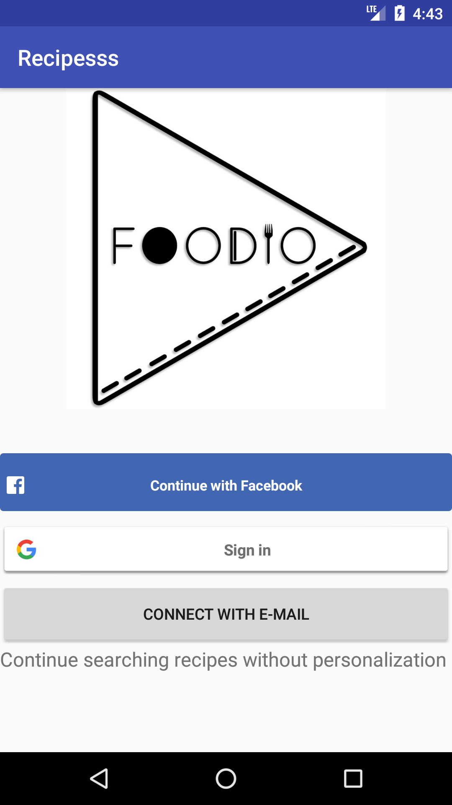

This application is a recipe finder application. It helps users to find general recipes and recipes by ingredient. These recipes are requested from yummly api. Authenticated users can store their recipes in a firebase database, whereas a local user can save recipes locally. The starting screen of the application looks like this:

        
         

 
The app starts off with the screen displayed above. As evident, the application supports Facebook, Google, and E-mail sign in. If a user does not want to sign in then the app can be continued as a local user. These options are provided, so that a user can also save recipes to their favorites list. If a user is authenticated (i.e. facebook, google or E-mail user) then recipes are saved in a firebase database. This has the advantage that the favorites list can also be accessed from a different device. A local user can save his or her recipes in a favorites list, but this is only accesible on the given device. 

After this, the user is navigated to the general recipes activity. Here a user can do a general recipe query. The query can match anything in the recipe: a title, ingredient, or attributes. If the user clicks on ingredient-based recipes then the user is sent to a similar looking screen, but with one key difference: The query needs to completely match the ingredients of a given recipe. In both cases (if there are any recipes) the images of these recipes are displayed in a gridview (in the next activity). If the user would prefer to see the titles of recipes, then the 'list titles' button can be clicked. 
        
In both cases the user is navigated to the recipe itself when a given recipe is clicked. Here the specifics of a recipe are given, like the title, image, ingredients and attributes. The recipe can be added by clicking the plus button. This can only be done once, since the application does not allow duplicate entries. To view the favorites, the user can click the favorites button. These favorites are displayed in a listview.  

<b>Activities</b>
 
 
<i>MainActivity:</i>

This is where the user can log in using Facebook, google, or to continue as a local user. Sign in functionality for the google user is implemented within the activity, because the sign in method needs to pass a google api client. This api client gets connected in onStart and is only then not null. Therefore it is better if the sign in method also is done within the activity. Both the facebook and google sign in returns a result. In onActivityResult it is checked whether this is the correct result, and if this is the case the user is fetched and is logged in. Another important aspect implemented in this activity is the redirect to the previous activity the user was in before the app was closed. This is done with the utils class, and specifically the method 'redirectUserToCorrectActivity'. 

<i>RegistrationActivity: Registers or logs an E-mail user in</i>

- logMeIn: logs an e-mail user in
- submit: creates a user account and attempt sign in

<i>RecipeActivity: In this screen there is a searchview where a general recipe query can be done. </i>
 
- processFinish: after asynctask is done the recipes are sent to this function. This function in turn sends it to the returnRecipesToGridview function within the utils class. Reason for this is because this function is implemented twice. 
- loginOrLogout:if the user is authenticated then he or she is signed out, and sent to the MainActivity. Otherwise the user is just brought to the MainActivity to sign up. 
- recipeByIngredient: User is sent to the RecipeByIngredientActivity
- Favorites: User is sent to FavoritesActivity

<i>RecipeByIngredientActivity: In this screen there is a searchview where a query based on ingredients can be done. </i>
 
 
- GeneralRecipes: this is the only method different from the last activity. This method navigates the user back to RecipeActivity. 
 
<i>DisplayRecipesActivity:</i>

- setImageAdapter: Sets an imageAdapter on the recipe data passed from RecipeActivity or RecipeByIngredientActivity and displays them in a gridview
- logout: Logs an authenticated user out and sends him or her back to MainActivity. A local user is just brought to MainActivity to sign up
- listTitles: User is navigated to TitleActivity
- goToFavoritesActivity: User is navigated to FavoritesActivity

 

<i>TitleActivity: Sets titles of recipes in a listview</i>

 

- setAdapter: Removes duplicate recipes, and sets RecipeAdapter on listview
- logout: logs user out
-  favorites: goes to FavoritesActivity
 

<i>DetailsActivity:

- recipeReturned: Returns recipe from correct activity
- getRecipeFromPreviousUsage: Gets recipe from sharedpreference that has been saved when before the app has been closed. 
- setupDetails: sets the title, image, ingredient and attributes of a given recipe in the textviews. 
- initializeImage: loads image into imageview
- goToFavorites: adds a recipe to favorites for all users
- addRecipeToDB: adds recipe to firebase for authenticated user
- fetchRecipesForLocalUser: grabs recipes from sharedpreferences
- addRecipeToFavorites: adds recipe to sharedpreferences
- logout: logs user out
- favorites: goes to favorites
 
<i>FavoritesActivity: populates listview with favorites </i>

-RecipesUser function called from FavoritesHelper, which returns the correct recipes
- onItemClick from helper class called, which sends the clicked recipe to detailsActivity
- onItemLongClick called, which removes a given recipe from sharedpreferences/firebase and updates the list
 
<b>Classes</b>
- Recipe modelclass: this modelclass contains getters and setters for title, image, ingredients and attributes. 
- Recipes modelclass:A modelclass which is in reality a list of recipe objects. it only has getters and setters for titles, because those were the only ones needed in this application. 
- RecipeCompare:Compares two recipes objects to check if they are equal. They are only equal if all the fields match between two objects. 
- myApplication: returns context in static environment. 
onClickListener: class that is triggered when user signs out. Put in class, because application offers sign out buttons in multiple activities. 
 
<i>FacebookSignIn: This class helps to log a facebook user in,  get their profile information, and navigate them to the next activity. </i>

- createCallBack: creates a callback, logs accesstokens, and calls registerCallBack
- handleFacebookAccessToken: uses accesstoken to authenticate user with firebase
- executeFacebookAsyncTask: calls handleFacebookAccessToken to authenticate user, and then execute async task to facebook API.
- submitGraphRequest:returns a Graphrequest object
- registerCallBack: registers callback, sets permissions to read facebook data and sends graphrequest object to executeFacebookAsyncTask 
-submitGraphRequest:returns a Graphrequest object  
<i>GoogleSignIn: This class contains methods to help with the authentication of google users.
</i> 
 

- buildApiClient: Builds google api client
- connectToApi: connect google api client
- disconnectFromApi:disconnects google api client
- firebaseAuthWithGoogle: authenticates google user with firebase
- handleSignInResult: gets user data and sends user to next activity if sign in is succesful
- signOut: signs google user out
 

<i>EmailSignIn: Helper class to create user accounts and log users in.</i> 
 

- createAccount: tries to create user account with information given in edittexts in registrationActivity, and sign user in
- signInWithEmailAndPassword: signs user in with email and password given in edittexts. If it is succesful go to the next activity.
<i>onQueryTextListener: Helper class for the queries performed in recipeActivity and recipeByIngredientActivity </i>
- search: grabs query text, loops over characters and checks if it contains numbers, or non-alphabetical characters. If so the asynctask is not executed. The function also makes sure that the asynctask is not executed more than once, and sets up the progressbar while in the recipeActivity or recipeByIngredientActivity. 

<i>AsyncWithInterface: This class implements an asynctask that is performed in both recipe activities. This is done by making use of an interface. This choice has been made, because with a regular asynctask a lot of code needs to be copied and put in a seperate file, because the context of a specific activity is passed.   </i>

- onPreExecute: code that is run before the asynctask is performed. Not really used, because progressbar is set up in  onQueryTextListener class
- doInBackground: function to download recipes from yummly api endpoint
- onPostExecute:sends downloaded recipes to processFinish function (implemented in RecipeActivity and RecipeByIngredientActivity
- recipesReturned: passes json array to initializeRecipes, gets recipes object back and sends it to onPostExecute
- initializeRecipes: converts json array into a recipes object, and sends object back to recipesReturned. 
- formatImageLink: formats the image link, so that the image can be put in imageview.

<i>HttpRequestHelper: Helper class to download recipes from yummly api endpoint </i>
 
- downloadFromServer: returns json string from yummly api endpoint
- returnCorrectUrl: returns url based on if user is in RecipeActivity or RecipeByIngredientActivity
- createUrlObject: creates an url object from the string of returnCorrectUrl.
- uses url object to download json string from yummly api and pass it to downloadFromServer function

<i>ImageAdapter: populates gridview with images of downloaded recipes</i>
getView: loads every image of every recipe into the gridview
- loadImageData: uses picasso library to load recipe images
 
<i>RecipeAdapter: An extension of arrayAdapter that makes it possible to set a Recipes object on the adapter </i>
- getView: sets a given recipe title on a row. 

<i>Utils: Class created to hold code that is used more than once and that isn't a listener or strictly used for favorites</i>
 
<i>FavoritesHelper: Helper class for favoritesActivity</>
- fetchFavorites: fetches favorites from firebase for an authenticated user
- recipesUser: returns recipes of authenticated and local users
- onItemClick: when an item is clicked a given recipe is passed to DetailsActivity
- onLongClick: Click event for removing a recipe. 
- removeRecipeFromDB: Removes recipe from database if the user is authenticated
- removeRecipeFromSharedPreferences: removes a given recipe from sharedpreferences for a local user
- recipeDBbToDetailsActivity: sends recipe of an authenticated user to DetailsActivity
- toDetailsActivity: sends recipe to detailsActivity for a local user
- setAdapter: sets adapter on listview and sets up progressbar
- recipesIsEmpty: displays an empty textview if the favoriteslist is empty
