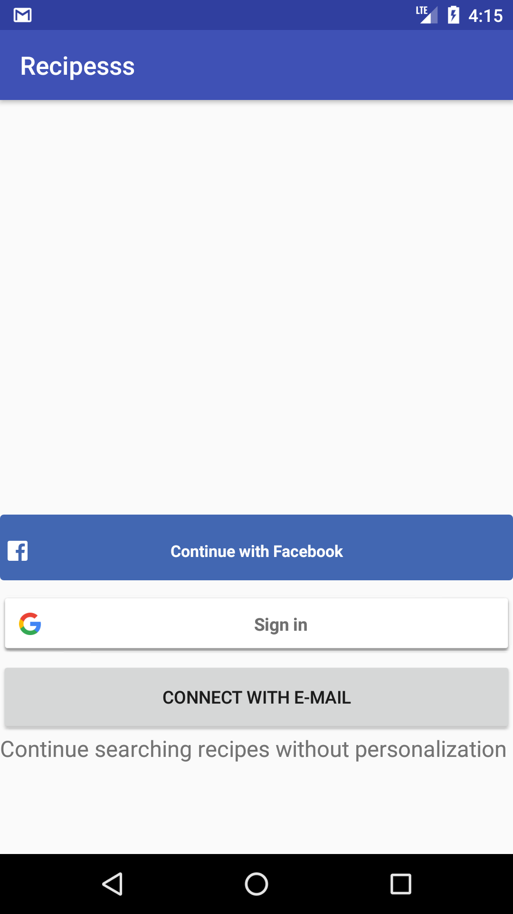

This application is a recipe finder application. It helps users to find general recipes and recipes by ingredient. These recipes are requested from yummly api. Authenticated users can store their recipes in a firebase database, whereas a local user can save recipes locally. The starting screen of the application looks like this:

        
         

 
The app starts off with the screen displayed above. As evident, the application supports Facebook, Google, and E-mail sign in. If a user does not want to sign in then the app can be continued as a local user. These options are provided, so that a user can also save recipes to their favorites list. If a user is authenticated (i.e. facebook, google or E-mail user) then recipes are saved in a firebase database. This has the advantage that the favorites list can also be accessed from a different device. A local user can save his or her recipes in a favorites list, but this is only accesible on the given device. 

After this, the user is navigated to the general recipes activity. Here a user can do a general recipe query. The query can match anything in the recipe: a title, ingredient, or attributes. If the user clicks on ingredient-based recipes then the user is sent to a similar looking screen, but with one key difference: The query needs to completely match the ingredients of a given recipe. In both cases (if there are any recipes) the images of these recipes are displayed in a gridview (in the next activity). If the user would prefer to see the titles of recipes, then the 'list titles' button can be clicked. 
         

Functions</b>

- onPreExecute: code that is run before the asynctask is performed. Not really used, because progressbar is set up in  onQueryTextListener class

- doInBackground: function to download recipes from yummly api endpoint
- onPostExecute:sends downloaded recipes to processFinish function (implemented in RecipeActivity and RecipeByIngredient activity . 
- recipesReturned
- initializeRecipes
- formatImageLink

</figcaption
</figure>
