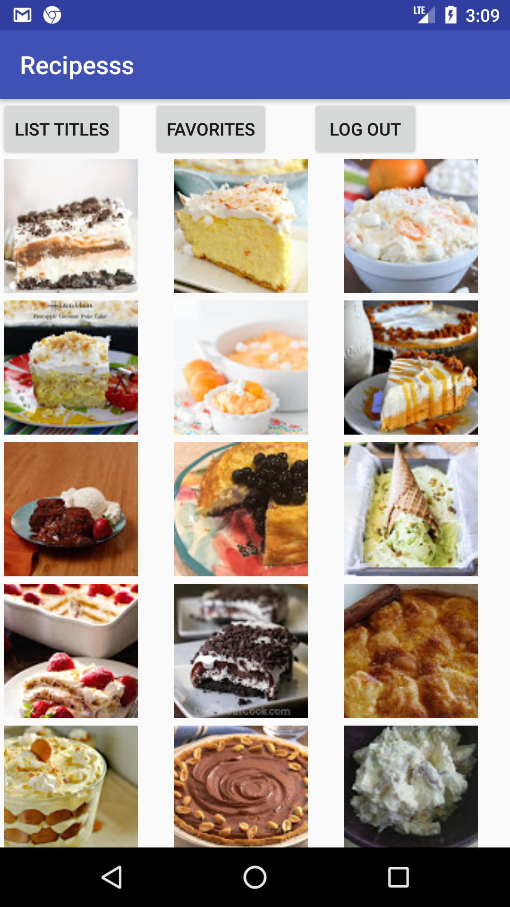

This application is a recipe finder application. It helps users to find general recipes and recipes by ingredient. These recipes are requested from yummly api. Authenticated users can store their recipes in a firebase database, whereas a local user can save recipes locally. When a query is done the recipes are initially viewed like this:

        
         

 
The app starts off with a login screen. The application supports Facebook, Google, and E-mail sign in. If a user does not want to sign in then the app can be continued as a local user. These options are provided, so that a user can also save recipes to their favorites list. If a user is authenticated (i.e. facebook, google or E-mail user) then recipes are saved in a firebase database. This has the advantage that the favorites list can also be accessed from a different device. A local user can save his or her recipes in a favorites list, but this is only accesible on the given device. 

After this, the user is navigated to the general recipes activity. Here a user can do a general recipe query. The query can match anything in the recipe: a title, ingredient, or attributes. If the user clicks on ingredient-based recipes then the user is sent to a similar looking screen, but with one key difference: The query needs to completely match the ingredients of a given recipe. In both cases (if there are any recipes) the images of these recipes are displayed in a gridview (in the next activity). If the user would prefer to see the titles of recipes, then the 'list titles' button can be clicked. 
        
In both cases the user is navigated to the recipe itself when a given recipe is clicked. Here the specifics of a recipe are given, like the title, image, ingredients and attributes. The recipe can be added by clicking the plus button. This can only be done once, since the application does not allow duplicate entries. To view the favorites, the user can click the favorites button. These favorites are displayed in a listview.  

<b>Activities</b>
 
 
<i>MainActivity:</i>

- Facebook authentication
- Google authentication
- continue as local user
- redirect user to correct activity if app was closed
 

Sign in functionality for the google user is implemented within the activity, because the sign in method needs to pass a google api client. This api client gets connected in onStart and is only then not null.
 

<i>RegistrationActivity: Registers or logs an E-mail user in</i>

- logMeIn: logs an e-mail user in
- submit: creates a user account and attempts sign in

<i>RecipeActivity: In this screen there is a searchview where a general recipe query can be done. </i>
 
- processFinish: after the asynctask is done the recipes are sent to this function. This function in turn sends it to the returnRecipesToGridview function within the utils class. The Reason for this is because this function is implemented twice. 
- loginOrLogout:if the user is authenticated then he or she is signed out, and sent to the MainActivity. Otherwise the user is just brought to the MainActivity to sign up. 
- recipeByIngredient: User is sent to the RecipeByIngredientActivity
- Favorites: User is sent to FavoritesActivity

<i>RecipeByIngredientActivity: In this screen there is a searchview where a query based on ingredients can be done. </i>
 

- GeneralRecipes: this is the only method different from the last activity. This method navigates the user back to RecipeActivity. 
 

<i>DisplayRecipesActivity:</i>

- setImageAdapter: Sets an imageAdapter on the recipe data passed from RecipeActivity or RecipeByIngredientActivity and displays them in a gridview
- logout: Logs an authenticated user out and sends him or her back to MainActivity. A local user is just brought to MainActivity to sign up
- listTitles: The user is navigated to TitleActivity
- goToFavoritesActivity: The user is navigated to FavoritesActivity

 

<i>TitleActivity: Sets titles of recipes in a listview</i>

- setAdapter: Removes duplicate recipes, and sets RecipeAdapter on listview
- logout: logs user out
-  favorites: goes to FavoritesActivity
 

<i>DetailsActivity</i>:

- recipeReturned: Returns recipe from correct activity
- getRecipeFromPreviousUsage: Gets recipe from sharedpreference that has been saved before the app has been closed. 
- initializeImage: loads image into imageview
- setupDetails: sets the title, image, ingredient and attributes of a given recipe in the textviews. 
- fetchRecipesForLocalUser: grabs recipes from sharedpreferences
- addRecipeToFavorites: adds recipe to sharedpreferences
- addRecipeToDB: adds recipe to firebase for authenticated user
- goToFavorites: adds a recipe to favorites for all users
- logout: logs user out
- favorites: goes to favorites
 

<i>FavoritesActivity: populates listview with favorites </i>
 

- RecipesUser function called from FavoritesHelper, which returns the correct recipes
- onItemClick from helper class called, which sends the clicked recipe to detailsActivity
- onItemLongClick called, which removes a given recipe from sharedpreferences/firebase and updates the list
 
<b>Classes</b>
 
 

- Recipe modelclass: this modelclass contains getters and setters for title, image, ingredients and attributes. 
- Recipes modelclass:A modelclass which is in reality a list of recipe objects. it only has getters and setters for titles, because those were the only ones needed in this application. 
- RecipeCompare:Compares two recipes objects to check if they are equal. They are only equal if all the fields match between two objects. 
- myApplication: returns context in static environment. 
- onClickListener: class that is triggered when user signs out. Put in class, because application offers sign out buttons in multiple activities. 
 
<i>FacebookSignIn: This class helps to log a facebook user in,  get their profile information, and navigate them to the next activity</i>
 
 

- createCallBack: creates a callback, logs accesstokens, and calls registerCallBack
- submitGraphRequest:returns a Graphrequest object
- handleFacebookAccessToken: uses accesstoken to authenticate user with firebase
- registerCallBack: registers callback, sets permissions to read facebook data and sends graphrequest object to executeFacebookAsyncTask 
- executeFacebookAsyncTask: executes async task to facebook API.
  

<i>GoogleSignIn: This class contains methods to help with the authentication of google users.</i> 
 
 

- buildApiClient: Builds google api client
- connectToApi: connect google api client
- disconnectFromApi:disconnects google api client
- firebaseAuthWithGoogle: authenticates google user with firebase
- handleSignInResult: gets user data and sends user to next activity if sign in is succesful
- signOut: signs google user out
 

<i>EmailSignIn: Helper class to create user accounts and log users in.</i> 
 

- createAccount: tries to create user account with information given in edittexts in registrationActivity, and sign user in
- signInWithEmailAndPassword: signs user in with email and password given in edittexts. If it is succesful go to the next activity.
 

<i>onQueryTextListener: Helper class for the queries performed in recipeActivity and recipeByIngredientActivity </i>

- search: grabs query text and converts it to lowercase, loops over the characters and checks if it contains numbers, or non-alphabetical characters. If so the asynctask is not executed. The function also makes sure that the asynctask is not executed more than once, and sets up the progressbar while in the recipeActivity or recipeByIngredientActivity. 

<i>AsyncWithInterface: This class implements an asynctask that is performed in both recipe activities. This is done by making use of an interface. This choice has been made, because with a regular asynctask a lot of code needs to be copied and put in a seperate file, because the context of a specific activity is passed.   </i>

- onPreExecute: code that is run before the asynctask is performed. Not really used, because progressbar is set up in  onQueryTextListener class
- doInBackground: function to download recipes from yummly api endpoint
- onPostExecute:sends downloaded recipes to processFinish function (implemented in RecipeActivity and RecipeByIngredientActivity
- recipesReturned: passes json array to initializeRecipes, gets recipes object back and sends it to onPostExecute
- initializeRecipes: converts json array into a recipes object, and sends object back to recipesReturned. 
- formatImageLink: formats the image link, so that the image can be put in imageview.

<i>HttpRequestHelper: Helper class to download recipes from yummly api endpoint </i>
 
- downloadFromServer: returns json string from yummly api endpoint
- returnCorrectUrl: returns url based on if user is in RecipeActivity or RecipeByIngredientActivity
- createUrlObject: creates an url object from the string of returnCorrectUrl.
- uses url object to download json string from yummly api and pass it to downloadFromServer function

<i>ImageAdapter: populates gridview with images of downloaded recipes</i>
getView: loads every image of every recipe into the gridview
- loadImageData: uses picasso library to load recipe images
 
<i>RecipeAdapter: An extension of arrayAdapter that makes it possible to set a Recipes object on the adapter </i>

- getView: sets a given recipe title on a row. 
 
<i>Utils: Class created to hold code that is used more than once and that isn't a listener or strictly used for favorites</i>
 

- getSignInType: gets the sign in type of a user. 
- signoutOrSignUp: signs user out if the user is authenticated, otherwise the user just goes to sign up screen
- returnRecipesToGridview: Wraps recipes so that every row has three items, then returns recipes to toGridView function. 
- toGridview: sends recipes to DisplayRecipesActivity
- addOrFetchRecipes: adds recipes to shared preferences if the recipes are sent from a different activity. If this is not the case then the application has been restarted, so the recipes have been saved in sharedpreferences and need to be fetched. 
- redirectUserToCorrectActivity: Redirect user to the activity the user was in before the app was closed
- setupProgressBar: sets up progressbar. 
 
<i>FavoritesHelper: Helper class for favoritesActivity</i>

- fetchFavorites: fetches favorites from firebase for an authenticated user
- recipesUser: returns recipes of authenticated and local users
- onItemClick: when an item is clicked a given recipe is passed to DetailsActivity
- onLongClick: Click event for removing a recipe. 
- removeRecipeFromDB: Removes recipe from database if the user is authenticated
- removeRecipeFromSharedPreferences: removes a given recipe from sharedpreferences for a local user
- recipeDBbToDetailsActivity: sends recipe of an authenticated use r to DetailsActivity
- toDetailsActivity: sends recipe to detailsActivity for a local user
- setAdapter: sets adapter on listview and sets up progressbar
- recipesIsEmpty: displays an empty textview if the favoriteslist is empty
 
<b>Challenges</b>
 
in the design document I made the choice for Spoonacular API because this supported the most functionality, and was best documented. However they were experiencing technical difficulties, so I had to change my choice of API. I picked yummly because it was reasonably documented, albeit with less functionality (autocomplete is not supported for example). Therefore I have not implemented autocomplete functionality. Differentiation between general recipes and recipes by ingredient has not been implemented. The reason is because the async task is implemented with an interface, so there is only one async task for two activities. The only difference is the endpoint and the recipes that are returned. Therefore, it is also not necessary to have a recipesByIngredient object, because both endpoints return recipes, they are just different in which recipes are returned. There is however still a populateGridview function, which is called toGridView and is implemented in the utils class.  In the design document I had more fields that I wanted to use to display details. However I have not implemented preparation, type of food and calories. 

An important change that I have made compared to the design document is storing complete objects in firebase instead of just the titles. 
The reason for this change was that I needed to compare the objects in the database with an item that is being clicked to check if it is a duplicate or not. If I would have kept the data as titles, then it would only check if the titles are equal, and hence not allowing different elements which have the same title in the favorites list. Another change which is related to the former change is replacing the built in arrayadapter with a recipe adapter. Otherwise I would need to first grab the object, and just grab the titles of those objects and add them to an arraylist of strings. This seems like a detour, so I decided to implement a recipe adapter. From these two points I have learned that is best to not go for the easy way, even though in the beginning it seems like it is possible. It can be just little details with which you need to rebuild a big part of the application. Furthermore I have made two important additions compared to the design document. A local user now has the option to sign up with an authentication method if he or she wants to later on in the application. Also, if a user wants their recipes displayed as titles this is also possible. 

<i>Trade-offs</i>

As mentioned, it is positive that I have made the changes listed above, because it reduces buggyness of the program and provides extra functionality to the user. However, there are things I would like to do different next time. I would like to make my recipes modelclass more readable, because now (mainly in favoritesHelper class) the code for removing, recipes for example is very long. also using position to grab a given recipe from the recipes object creates a long statement. Also, even though I said it was not necessary to create a recipes by ingredient object, it does make the application more maintainable, since if changes arise in the recipes by ingredient endpoint I can adjust these only in the recipes by ingredient object. I could use decomposition to construct a recipes by ingredient object from the recipes object or just inherit from recipes. Another learning point for me was that I should not go too extreme in refactoring my code just to get a better grade on bettercodehub. Now functions are considerabely small, but I call functions inside functions, which makes the program hard to follow. Next time I would like to try to find a better balance between short units of code and readability. 
