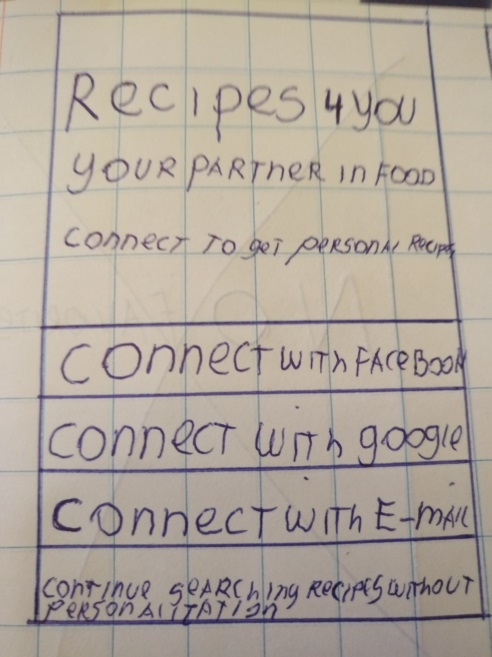
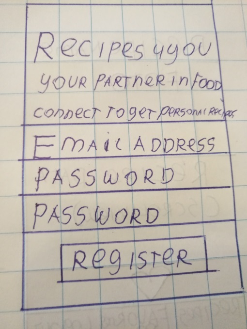
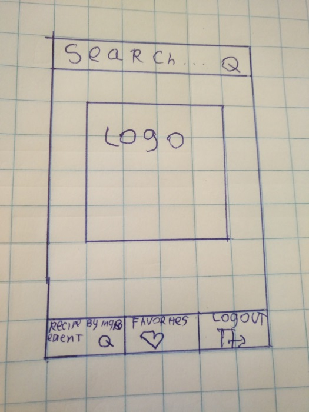
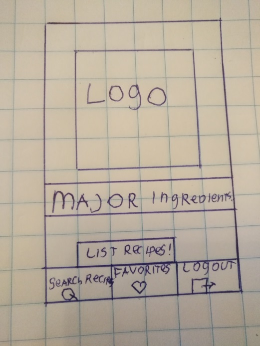
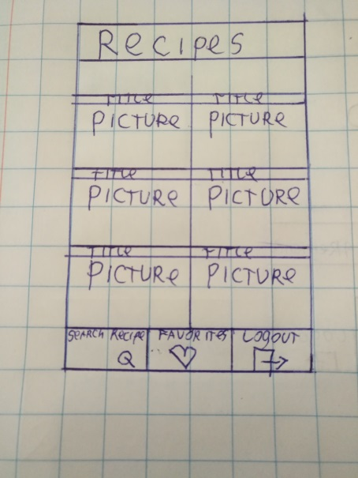
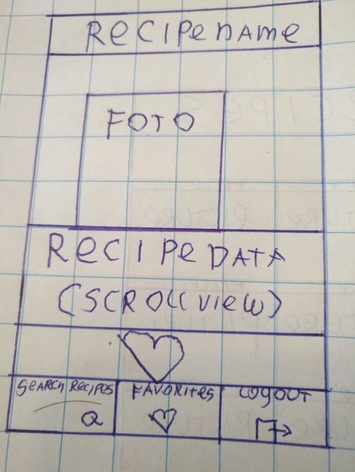
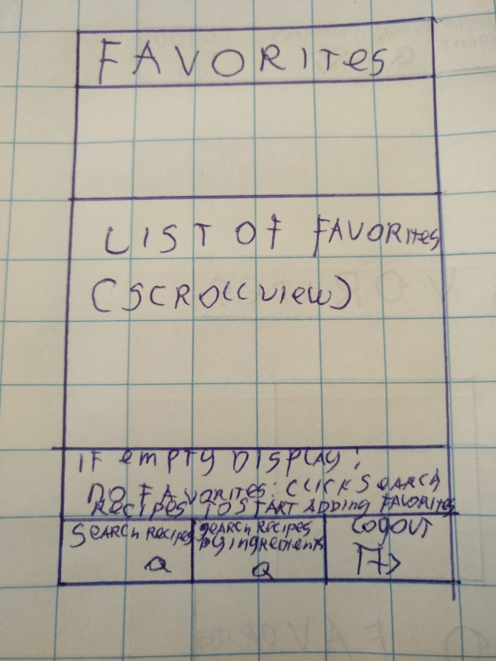

Copyright 2017 Daniel Jacob

# Proposal programmeerproject | University of Amsterdam 2017 | Studentnumber: 10001228 | Recipe app Recipesss

Problemdefinition

Dutch people spend 2.5 billion euros per annum wasting food (nu.nl). Food waste has at least two negative effects. First, food waste is expensive, since with the waste of food ‘new’ food will be bought faster and more often. Second, food waste is bad for the environment. By reducing food waste the total co2 emissions could be decreased. These are important reasons to minimize the waste of food. Recipes4you would like to make a contribution to this challenge.

Functions to solve part of the food waste problem

Login and registration screen
General recipe search
Recipe by ingredient search (comma separated)
Detailed recipe information
Mark recipes as favorite
Remove favorites
Sketches

  
  
  
  
  
  
  

          

Data sets and data sources

The app will make use of the spoonacular food ontology database. This database has general recipe data, as well as ingredient-based recipe data. This makes the dataset suitable for the problem that needs to be solved. The database returns JSON objects with titles and images which can be used to populate the gridview (for both searches). A recipe can be clicked, which gives further information about the recipe. Favorites will be stored in a firebase database, when retrieved these will be populated in a listview.

What separate parts of the application can be defined and how do these work together

Login and registrationscreen. Both screens redirect to the recipe search screen

general recipes: When a query is done here the query can match anything within the recipe, like title, ingredients or attributes.

Recipe by ingredient: Here the query needs to exactly match the ingredients of a given recipe. 

In both cases when a recipe is clicked full information of the recipe is given

Favoritescreen: An arraylist of favorites displayed using RecipeAdapter.

External components:

- Yummly api
- Gson to store and fetch recipes through sharedpreferences

Possible problems that may arise during development

•	Smooth control flow between screens •	Make sure that screens are only accessed if the user is authorized (i.e. no favorites screen for people who didn’t login. •	Connecting to API, only worked with an api once or twice before. •	In conjunction with the former: Only made connection with an api in the past, which had only 1 endpoint. Doing recipe based search and regular search creates two endpoints. Not sure if this will complicate my asynctask and httprequesthelper •	First time using gridview. Used listview in the past (which I also will be using for favorites). Probably need a different adapter to bind the data to a gridview. Something I need to check out. •	Setting up facebook and google connectivity

MVP

General recipe search, ingredient based search, being able to add them as favorites, and populating them in a gridview. (including login and regstrationscreens).

Possible extra functionality

-	Shopping list -	Functionality to share a given recipe within the app. -	Possibility to add or remove friends -	If the former is realized a possibility to chat with these friends
Review of similar apps:

Foodies: This app has implemented the ingredient-based search, but doesn’t have a general recipe search.
Yummlies: almost complete recipe application, with: 1). Shopping list, recipes, videos about recipes, a shop to buy cooking materials). However this app seems to be missing ingredient-based search. •	Conclusion: it would be great to develop an app which combines general recipe search, and ingredient-based recipe search !
© 2017 GitHub, Inc.
